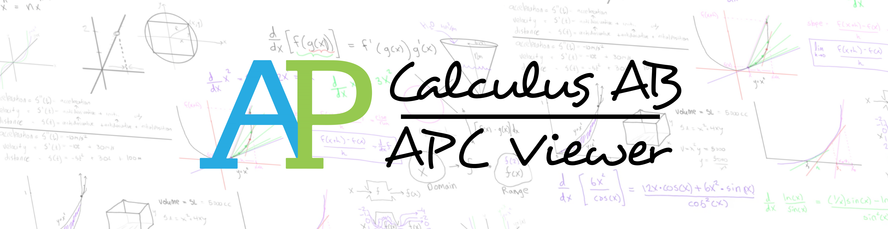

# AP Calculus AB PastPapers/Review App

Hello! In the same "For students, By students" spirit, I have started this project to help fellow AP Calculus AB students with their studies, either for upcoming tests or the final AP Exam.

## Getting Started

These instructions will get you a copy of the project up and running on your local machine. 
(If you’d like a copy of the source code for further development, testing purposes, go see Code panel for notes on how to deploy the project on a live system)

## Prerequisites

*Operating System: Windows*
> This project was built using .NET framework. As the .NET Framework is not available on Mac or Linux operating systems, I cannot take a compiled application that targets the .NET Framework and try to get it to run on Mac OS. See FAQ for more information.

*Adobe Acrobat*
> This application uses Adobe Acrobat’s API as a way to view files.
> You can find and download Adobe Acrobat at https://get.adobe.com/reader/, please download and install the Free Adobe Acrobat, the Adobe Acrobat Pro is not needed to run this application.
> You do not need to download Acrobat if you already have it installed.

## Installing

There should be a file in the Debug folder where you can find a .exe file. A .msi is too heavy so I can't upload it to here

## Built With
Visual Studio 2019 - IDE of choice
.NET Framework (WPF) - Development framework used
C# - Language used

## Version
▶ 1.2.0 Build 2.0_cjd_final

## Author(s)
wlux

### Full document on subject
**bit.ly/39gpQr0**
